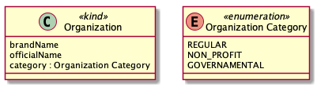
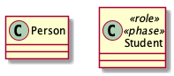
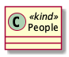
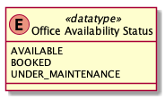
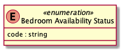

# OntoUML 2 Constraints Documentation

This document contains a description of all issues raised by the violated of constraints checks in OntoUML 2 model. This document covers all constraints implemented by the OntoUML 2 Verification service which is provided at the OntoUML Server.

Constraints are checked over individual model elements and their violation implies on the generation of `VerificationIssue` objects that contains the following fields:

- `code`: an string code which identifies the issue.
- `title`: a short human-readable string that describes the issue regardless of related elements. 
- `description`: a human-readable string that describes the issue considering the source and the related elements.
- `source`: the object that violates the constraint.
- `context`: an array of objects that compose the constraint violation along with the source.
- `severity`: a string that identifies the of the issue as either `"ERROR"` or `"WARNING"`. The former indicates that the issue is a model inconsistency that prevents the model from being processed by other services (e.g., model transformation services or model simulation services). The later, on the other hand, may indicate a model incompleteness or bad practice that does not prevent the model to be processed by other services.
- `alternatives`: an array of alternative objects that indicate optional actions for resolution of the issue.

```json
{
    "code": "CLASS_PLURAL_NAME",
    "title": "Classes should not have plural names.",
    "description": "The class People should have its name in the singular form (Person).",
    "source": {
        "type": "CLASS",
        "id": "1",
        "name": "People",
        ...
    },
    "context": null,
    "severity": "WARNING",
    "alternatives": [ ... ],
}
```

The `alternatives` field may contain an array of `VerificationAlternative` objects that indicate to the modeler and the tool optional alternatives for the resolution of the issue. These alternatives can possibly automatically processed by tool support upon user selection, but not necessarily. `VerificationAlternative` objects contain the following fields:

- `code`: an string code which identifies the alternative.
- `title`: a short human-readable string that describes the alternative regardless of related elements. 
- `description`: a human-readable string that describes the alternative considering the related elements.
- `elements`: an array of corrected objects that allow automatic processing of the alternative.

```json
{
    "code": "ONTOUML_CLASS_NAME_TO_PLURAL",
    "title": "Change name to singular form.",
    "description": "Change name from People to Person.",
    "elements": [
        {
            "type": "CLASS",
            "id": "1",
            "name": "Person",
            ...
        }
    ]
}
```

This document is intended as source for documentation and comprehension of constraints and should be consulted whenever better understanding of an specific issue is necessary.

This document is not intended as a primary learning material, but rather as support material.

## Package Issues

This section lists all issues and alternatives related to package constraints in OntoUML 2 models.

There are no package constraints implemented at the moment.

## Class Issues

This section lists all issues related to classes in OntoUML 2 models.

### Minimal Consistency



Every class element must not raise any issue of severity `ERROR` in order to trigger any other constraint verification. The list of constraints checked for minimal consistency includes the following codes: CLASS_NOT_UNIQUE_STEREOTYPE, CLASS_INVALID_ONTOUML_STEREOTYPE, CLASS_NON_ENUMERATION_WITH_LITERALS, CLASS_ENUMERATION_WITH_PROPERTIES.

1. Issue Code - `CLASS_NOT_UNIQUE_STEREOTYPE` - `ERROR`



Error that indicates that the class does not have a unique stereotype from the set of class stereotypes in OntoUML 2 (i.e., «kind», «collective», «quantity», «relator», «mode», «quality», «subkind», «role», «phase», «category», «roleMixin», «phaseMixin», «mixin», «event», «historicalRole», «type», «datatype», and «enumeration»).

Suggested alternatives for this issue are:

 - Replace the current set of stereotypes for one from the set [«kind», «collective», «quantity», «relator», «mode», «quality», «subkind», «role», «phase», «category», «roleMixin», «phaseMixin», «mixin», «event», «historicalRole», «type», «datatype», «enumeration»] that properly indicates the semantics of the class. Alternative code: `REPLACE_ONTOUML_CLASS_STEREOTYPE`.

2. Issue Code - `CLASS_INVALID_ONTOUML_STEREOTYPE` - `ERROR`


Error that indicates that the class stereotype does not belong to the set of class stereotypes in OntoUML 2 (i.e., «kind», «collective», «quantity», «relator», «mode», «quality», «subkind», «role», «phase», «category», «roleMixin», «phaseMixin», «mixin», «event», «historicalRole», «type», «datatype», and «enumeration»).

Suggested alternatives for this issue are:

- Replace the current set of stereotype for one from the set [«kind», «collective», «quantity», «relator», «mode», «quality», «subkind», «role», «phase», «category», «roleMixin», «phaseMixin», «mixin», «event», «historicalRole», «type», «datatype», «enumeration»] that properly indicates the semantics of the class. Alternative code: `REPLACE_ONTOUML_CLASS_STEREOTYPE`.

3. Issue Code: CLASS_PLURAL_NAME



- Alternative Code: ONTOUML_CLASS_NAME_TO_PLURAL

4. Issue Code: CLASS_NON_ENUMERATION_WITH_LITERALS



- Alternative Code: REMOVE_LITERALS
- Alternative Code: REPLACE_ONTOUML_CLASS_STEREOTYPE_TO_ENUMERATION

5. Issue Code: CLASS_ENUMERATION_WITH_PROPERTIES



- Alternative Code: REMOVE_PROPERTIES
- Alternative Code: REPLACE_ONTOUML_CLASS_STEREOTYPE_TO_ENUMERATION

## Relation Issues

This section lists all issues and alternatives related to relation constraints in OntoUML 2 models.

There are no relation constraints implemented at the moment.

## Property Issues

This section lists all issues and alternatives related to property constraints in OntoUML 2 models.

There are no property constraints implemented at the moment.

## Literal Issues

This section lists all issues and alternatives related to literal constraints in OntoUML 2 models.

There are no literal constraints implemented at the moment.

## Generalization Issues

This section lists all issues and alternatives related to generalization constraints in OntoUML 2 models.

There are no generalization constraints implemented at the moment.


## Generalization Set Issues

This section lists all issues and alternatives related to generalization set constraints in OntoUML 2 models.

There are no generalization set constraints implemented at the moment.

